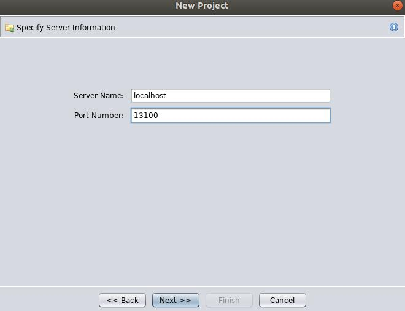
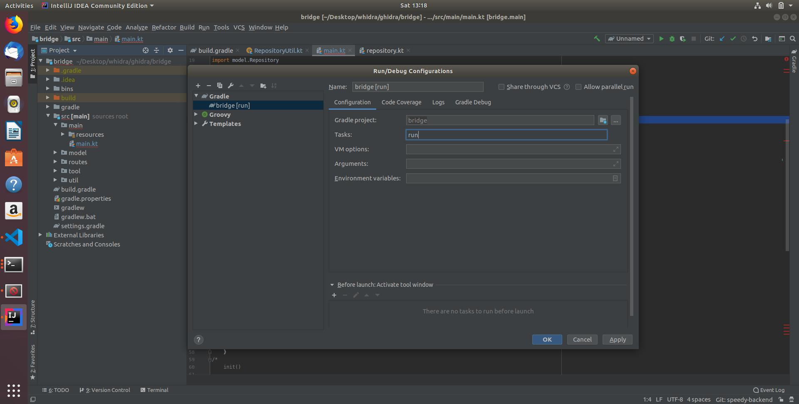
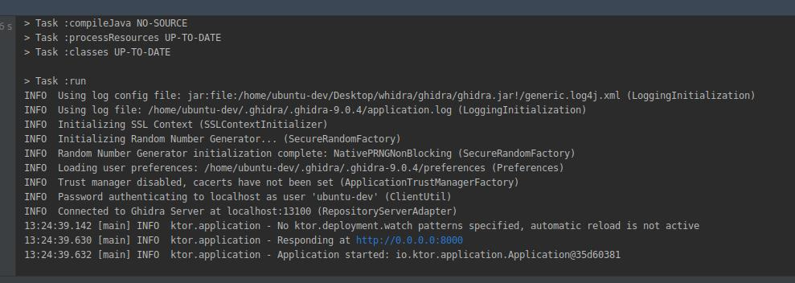
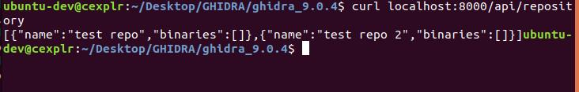

# whidra

Stands for **W**eb G**hidra**


## Development

Tested out with Ubuntu-18.04


```
git clone --branch speedy-backend https://github.com/enigmatrix/whidra.git
```

---

#### Install Ghidra   ** DUHHHH **

Head on to [https://ghidra-sre.org/](https://ghidra-sre.org/) and download the tar.gz file. 

Also install JDK11, for me I have created an oracle account just for this cause but anyways, here is the [https://www.oracle.com/technetwork/java/javase/downloads/index.html](https://www.oracle.com/technetwork/java/javase/downloads/index.html).

After that, add `PATH` in `~/.binsh`
```
export PATH=/path/to/jdk11/bin:$PATH
```

Then go to ghidra's folder and run 

```
./ghidraRun
```

Ghidra should be running.


---

#### Installation of Docker-Compose
Check this [link](https://docs.docker.com/install/linux/docker-ce/ubuntu/)
```
#! /bin/bash

sudo apt-get remove docker docker-engine docker.io containerd runc -y
sudo apt-get update
sudo apt-get install \
    apt-transport-https \
    ca-certificates \
    curl \
    gnupg-agent \
    software-properties-common -y
 curl -fsSL https://download.docker.com/linux/ubuntu/gpg | sudo apt-key add -
#sudo apt-key fingerprint 0EBFCD88
sudo add-apt-repository \
   "deb [arch=amd64] https://download.docker.com/linux/ubuntu \
   $(lsb_release -cs) \
   stable" -y
sudo apt-get update 
sudo apt-get install docker-ce docker-ce-cli containerd.io docker-compose -y
```

---

#### Add yourself in ghidra/server/start.sh

Allow ghidra server to recognise you

```diff
#!/bin/bash

server/ghidraSvr start
server/ghidraSvr stop
server/svrAdmin -add enigmatrix
server/svrAdmin -add daniellimws
server/svrAdmin -add ubuntu-dev
server/svrAdmin -add ghidra
+server/svrAdmin -add YOUR_COMPUTER_NAME
server/ghidraSvr console
```

---

#### Run docker-compose file

In the whidra project directory

```
sudo docker-compose -f docker-compose.yml -f docker-compose.dev.yml up --build ghidra
```

It takes some time to setup but if succeeded, you'll see this 

```
.
.
.
ghidra_svr | 420/0|ERROR Add User Failed: user 'ghidra' already exists (UserAdmin)  
ghidra_svr | 420/0|INFO  Started Block Stream Server on 127.0.0.1:13102 (BlockStreamServer)  
ghidra_svr | 420/0|INFO  Registering Ghidra Server... (GhidraServer)  
ghidra_svr | 420/0|INFO  Registered Ghidra Server. (GhidraServer)  
```

Now try creating a new project in Ghidra and select the shared-project radio button. If done correctly, you will need to specify server information. 



Click next and you can manage your repository in Ghidra.


The prompt for password with your added computer_name should be popped out.
The default password is `changeme`.

You might be prompted to change password but there is no need for now.

---

#### Bridge Project

The place where ktor is used to manage APIs. We can for example set this up and curl to find the repositories that has been created in the server.

Not needed but autocompletion by Idea is da bomb.
Head over to [https://www.jetbrains.com/idea/download/#section=linux](https://www.jetbrains.com/idea/download/#section=linux). Unpack and run under bin folder.

```
./idea.sh
```

Set it up and open project.  Aite, here open the whidra/ghidra/bridge directory. Importing of modules under gradle should be automatic.

You will need to run the bridge project by editing configuration beside the build button.



You should then see the run button appear.


If you want to use IntelliJ IDEA with all its type completion glory, you will need to build `ghidra.jar`
``` bash
analyzeHeadless . empty -postScript path/to/project/ghidra/server/BuildSingleGhidraJar.java path/to/project/ghidra/ghidra.jar -deleteProject -noanalysis
```


##### IF YOU CHANGED THE PASSWORD, Check that before running, check that under bridge/src/util/repositoryUtil.kt, the current hardcoded password is the password you set.

Run it and you should see similar log message.



You will see that you are connected to GhidraServer at localhost 13100.
To test it out, create repository and use the API to get the list

```
curl localhost:8000/api/respository
```
You will see something like this




You can import binary files manually by selecting the repository you created, right click on the file and click on `add to version control`. Double check with `curl localhost:8000/api/respository` and the binary should be listed.


Other APIs like :

Creating new repository

```
curl -X POST "localhost:8000/api/repository/new" -F "name=New_Repo_Name"
```

Importing binary

```
curl -X POST "localhost:8000/api/repository/import" -F "repository=New_Repo_Name" -F "binary=@/full/path/to/binary"
```

After that you can check with `curl localhost:8000/api/repository`


#### Getting Functions

```
curl "localhost:8000/api/binary/functions?binary=filename&repository=New_Repo_Name"
```

and to get the code,

```
curl "localhost:8000/api/binary/code?binary=filename&repository=New_Repo_Name"
```

---


There is hot reloading for the frontend when you run `./dev/sh`.

---
